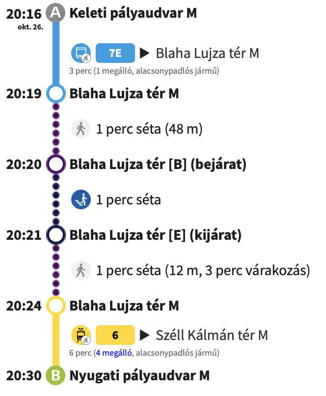

```text
 _____ ___________ _____   ___________ ___________  ______ _       ___   _   _  _   _  ___________ 
|  __ \_   _|  ___/  ___| |_   _| ___ \_   _| ___ \ | ___ \ |     / _ \ | \ | || \ | ||  ___| ___ \
| |  \/ | | | |_  \ `--.    | | | |_/ / | | | |_/ / | |_/ / |    / /_\ \|  \| ||  \| || |__ | |_/ /
| | __  | | |  _|  `--. \   | | |    /  | | |  __/  |  __/| |    |  _  || . ` || . ` ||  __||    / 
| |_\ \ | | | |   /\__/ /   | | | |\ \ _| |_| |     | |   | |____| | | || |\  || |\  || |___| |\ \ 
 \____/ \_/ \_|   \____/    \_/ \_| \_|\___/\_|     \_|   \_____/\_| |_/\_| \_/\_| \_/\____/\_| \_|
                                                                                                   
```

## A Program Célja 🏁

A program Budapest tömegközlekedését szimulálja, a BKK által nyújtott GTFS alapján. A felhasználó útvonaltervet tervezhet a kiinduló állomás, a célállomás és indulási időpont megadásával. A program visszaad egy útvonal tervet, ami tartalmazza:

* a kiindulási állomást, és hogy mikor indul onnan a jármű,
* az átszállási pontokat, illetve sétálási távolságot, ha szükséges, két megálló kötött.
* a célállomást, és, hogy mikor érkezik meg a jármű oda.

**Bellman-Ford algoritmust fogok használni a gráf építésére, viszont a körjáratok kezelése túlkomplikálná a feladatot szerintem, emiatt azokkal nem fogok foglalkozni**

## A Program Használata ▶️

A felhasználó a futtatáskor három input mezővel és egy gombbal fog találkozni.  

* Az első input mezőben a kiindulási állomást kell megadnia. Itt a felhasználó csak a budapesti tömegközlekedési hálózat megállónevei közül választhat. Miután elkezd gépelni a felhasználó, a program egy legördülő listát fog felajánlani, amely tartalmazza az összes olyan megállót, amely a felhasználó által megadott karakterekkel kezdődik.
* A második input mezőben a célállomást kell megadnia. Hasonlóan működik mint az első input mező.
* A harmadik input mezőben az indulási időpontot kell megadnia. Az időpontot a következő formátumban kell megadni: `yyyy/mm/dd HH:MM`.
* A gomb pedig a `Tervezés` gomb, amelyre kattintva a program megpróbálja megtalálni a leggyorsabb útvonalat a két megadott állomás között.

### Megtervezett Útvonal Terv
A tervezés gombra nyomás után egy ehhez hasonló felülettel fog találkozni a felhasználó:  
  
A fentebbi képen a BKK Futár utazástervezője látható, én is egy ehhez hasonló GUI-t tervezek készíteni.  
A meglállók és az őket összekötő vonalak, ha járműről beszélünk, akkor a vonaluk színei. Séta esetén pedig szürke, szaggatott vonal lesz.  
A jármű ikonokat nem fogom megjeleníteni, csak a busz nevét. Illetve a többi piktogrammot sem fogom használni, kizárólag a szöveges információkat fogok megjeleníteni.  

Ennek a felületnek az alján két gomb lesz:  

* Vissza gomb, amivel az előző menübe tud visszalépni.  
* Mentés gomb, amivel az útvonaltervnek egy ASCII art-os formáját elmenti egy txt file-ba. Példa:  

 ```text
    O-Keleti Pályaudvar  - 20:16
    |
    |--(7E ▶ Blaha Lujza tér M) 1 megálló - 3 perc
    |
    O- Blaha Lujza tér M - 20:19
    |
    |-- 1 perc séta (48m)
    |
    O- Blaha Lujza tér M - 20:24
    |
    |--(6 ▶ Széll Kálmán tér M) 4 megálló - 6 perc
    |
    O-Nyugati Pályaudvar - 20:30
```

## Fontosabb technikai részletek 🛠 

* A program Swing GUI-t fog használni.  
* Input fájljai a Budadepsti GTFS Zip kitömörített txt fájljai lesznek. (Több információ erről itt: <https://bkk.hu/bkk-partnerek/egyeb/gtfs-menetrendi-adatok-programozoknak/>)  
* Gráf építésére a Bellman-Ford algoritmust fogom használni.
* A séta távok 500m maximumban lesznek limitálva. Budapest utcai hálózatát nem fogom a gráfom építésénél figyelembe venni. A megállók lat és lon értékei alapján azokat a megállókat fogom összekötni séta éllel, ahol 200m vagy kevesebb a légtávolság.  
* A körjáratok megfelelő működését nem garantálom.